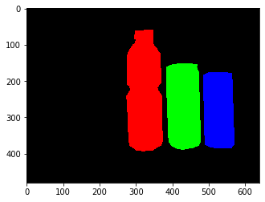

# Final Project for CoE 197F: Semantic Segmentation

This is a replication of the code from [here](https://github.com/PacktPublishing/Advanced-Deep-Learning-with-Keras/tree/master/chapter12-segmentation),
as part of the requirements for CoE 197F. Thus, the function names,
structure of the code, etc. are similar, except that this is a
PyTorch implementation (as opposed to a Keras implementation). The jupyter
notebook [`197F_project.ipynb`](197F_project.ipynb) shows how the functions
are used. Note that the actual training isn't shown, as it wasn't done in one
go. However, the saved [weights](weights/resnet_v2-300epochs.pth) from the training is used.

## Model

The model used is a  Fully Convolutional Network, with `resnet_v2` as the
backbone. All of the settings used are those that were set by default in
the original implementation, i.e. `n_layers = 4` and `depth = 56`.

The Fully Convolutional Network uses the `resnet_v2` backbone to  extract
various feature maps (from different layers, and thus have differing sizes)
from a minibatch of images, then upsamples them to 1/4 of the original
image size. A pixel-wise classifier is then applied to the concatenation of
the upsampled feature maps. The resulting output is a tensor of shape
`(batch_size, num_classes, height, width)`, with which the loss with respect
to the ground truth semantic segmentation can be calculated.

## Training

The training settings are as follows:
- Batch Size: `1`
- Number of Epochs: `300`
- Shuffled per epoch
- Loss function: `nn.CrossEntropyLoss` (categorical crossentropy)
- Optimizer: Adam
	- Learning rate: `1e-3`, decaying as dictated by the learning rate
		scheduler `lr_scheduler` in [`model_utils.py`](model_utils.py)

Note that this has almost the same settings as that in the original
implementation.

## Results

At the end of the training loop, the resulting model was evaluated on the test
dataset using the mean Intersection over Union (mIoU) and mean Pixel-level
accuracy metrics. The results are as follows:

- Mean Intersection over Union (mIoU): `0.761145`
- Mean Pixel-level accuracy: `70.625%`

### Randomly Selected Results

The following figures show the performance of the trained model on the test
dataset. These sets of images were randomly selected (to avoid cherry picking).
The derivation of these results can be seen in the jupyter notebook.

### Image / Ground Truth / Output 1

IoU: `0.7417`
PLA: `66.68%`  

### Image / Ground Truth / Output 2

IoU: `0.8142`
PLA: `72.73%`  

### Image / Ground Truth / Output 3

IoU: `0.7961`
PLA: `62.23%`  

